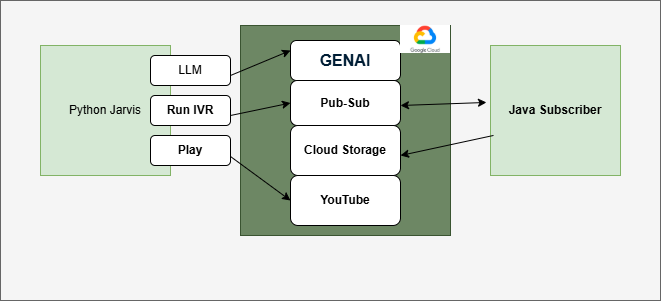

# ☎️ Java IVR Microservice



## 📌 Overview

This is a **Java Spring Boot microservice** designed to simulate an IVR (Interactive Voice Response) system.

---

## 🎯 Purpose

- **Subscribe** to `java-devops-ivr-sub`
- **Process user input**
- **Create a structured JSON response**
- **Save the response to a GCS bucket** for **data forensics, analytics, and auditing**

This service is part of a modular cloud-native architecture and serves as a backend component — it does not expose any public-facing APIs or services.

---

1. **Jarvis** publishes a user input message to `java-devops-ivr-sub`
2. **IVR microservice** receives the message
3. It creates a **JSON response** (e.g., transcript, sentiment, options)
4. The response is saved into a **GCS bucket** for external consumption or audit trail

---

## 📂 Tech Stack

| Component | Tool/Service               |
| --------- | -------------------------- |
| Language  | Java 17 (Spring Boot)      |
| Messaging | Google Cloud Pub/Sub       |
| Storage   | Google Cloud Storage (GCS) |
| Copilot   | /tests , prompt            |

---

## 🗂 Sample Response Structure

```json
{
  "timestamp": "2025-07-11T00:44:56.470539400Z",
  "userInput": "2",
  "response": "You selected option 2. Please hold for billing and other account inquiries."
}
```
